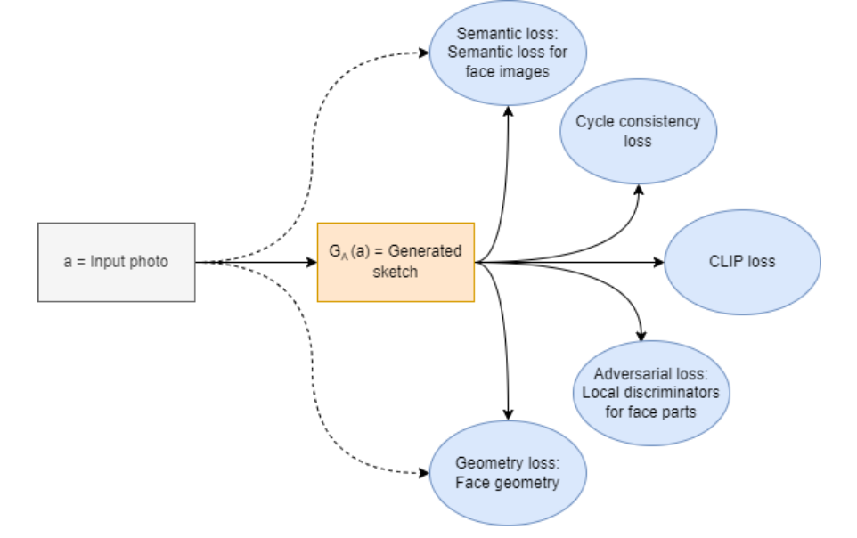

# Generating Sketches From Face Images

This project is about **generating sketches from face photographs by unsupervised learning**.  
Our aim was to improve Chan et al. (2022)’s model on **face images**.

## Method

The input is a face photo, and the model generates a sketch.  
We replicated the generator architecture in Chan et al. (2022)’s work and used **2 generators** with **CycleGAN** structure.

The model uses:
- **semantic loss** for face images
- **cycle consistency loss**
- **CLIP loss**
- **adversarial loss** with local discriminators for face parts
- **geometry loss** for face geometry

For adversarial loss, we used a **global discriminator** and local discriminators for **nose, eye, and lips**.  
For geometry loss, we used **SynergyNet**.  
For semantic loss, we used **BiSeNet**.

## Training

Our training had two phases:

- **Phase 1:** Pre-training with samples from **FFHQ** and sketches generated by Chan et al. (2022)’s model
- **Phase 2:** Fine-tuning with human-drawn sketches from the **APDrawing Dataset**

We did **9 experiments** with different configurations and evaluated them to find which directions were more promising.

## Results

We evaluated the models using:
- **FID**
- **FSIM**
- **Face recognition accuracy**

The results were mixed.  
Some experiments improved **face recognition accuracy**, but the **baseline** was still better in some metrics.  
Training was also very sensitive to the loss weights. In some cases, the model generated grayscale versions of the images instead of better sketches. 

# Some Acknowledgements
- FaceParsingNetwork folder contains codes from https://github.com/cientgu/Mask_Guided_Portrait_Editing
- SynergyNet folder contains the codes and files of SynergyNet (https://github.com/choyingw/SynergyNet)
